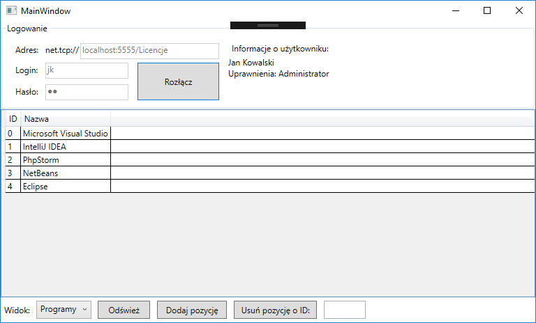
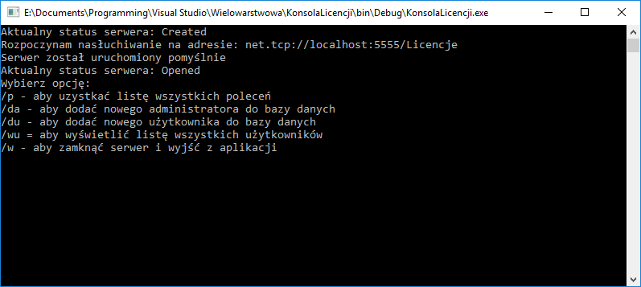
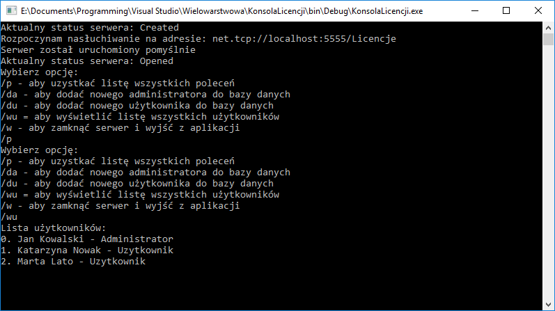

# LicenseServer

* @Author: TimsManter
* @AuthorSite: [TimsManter.NET](http://timsmanter.net/)
* @CreateDate: 2015-12
* @AbandonDate: 2016-11
* @Editor: Visual Studio Community 2015
* @Language: C#
* @Framework: .NET Framework
* @Locale: pl_PL
* @License: [MIT](LICENSE.md)
* @Status: Alpha | Abandoned | Sample

## Overview

LicenseServer is simple license management system with client-server architecture in mind. The purpose of this software is to serve central system with licenses database and provide desktop client application with ability to view, create, modify and remove licenses as well as users and registered software.

Client app allows users with different provileges to view own licenses. Administrators can add software, link software license to user and change various aspects like expiration time.

The core of communication is build using SOAP transport layer protocol and Windows Communication Foundation framework - a part of .NET Framework on Windows platform. Client-side applications takes the best from Windows Presentation Foundation framework.

## Binary

There are compiled binary files for Windows OS in [bin](bin/) folder.

> Note: Of course it will be necessary to install .NET Framework 4.5 to run it.

## Screenshots

### Client

|||
--- | ---
 | 
 | 

### Server

|||
--- | ---
 | 